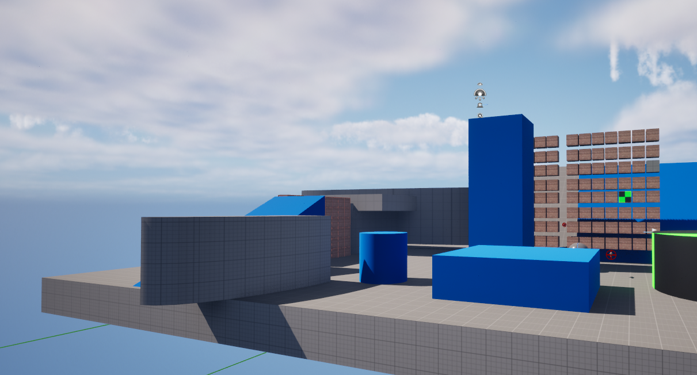

# Ballfire

第一人称射击闯关游戏，用 Unreal Engine 5.3 开发。

## 玩法

打破砖块，找到传送点进入下一关。

目前有 2 关：
- **第 1 关** — 基础入门
- **第 2 关** — 需要"跳出墙"才能过关

第 3 关还没做。

## 操作

| 按键 | 功能 |
|------|------|
| W/A/S/D | 移动 |
| 鼠标移动 | 视角 |
| 鼠标左键 | 发射 |
| 空格 | 跳跃 |

## 下载

前往 [Releases](https://github.com/zhe070822-creator/Ballfire/releases) 页面下载最新版本。

解压后运行 `Ballfire.exe` 即可。

## 开发

- 引擎：Unreal Engine 5.3
- 插件：ModelingToolsEditorMode
